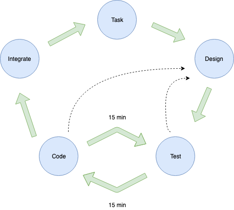

## Tasking Cycle

#### Summary

Value short feedback loops. Feedback loops include:
- unittest
- production feedback
- user feedback
- any data that provides data on the value/performace/inpact of the product

Use pair-programming in teams for all code to be merged to master.
Benefits:
- Removal of "Run over by buss" problem
- Disperse best practices in the team
- Share programming knowledge (make masters)
- Share knowledge about the system with new developers

Pair programming techniques:
 - Ping pong programmming (one write the test, another make it pass)

Avoid pairing equally skilled people.
Master, Novice
Master, Journeyman
Journeyman, Novice

NOT -> Novice, Novice or Journeyman, Journeyman

