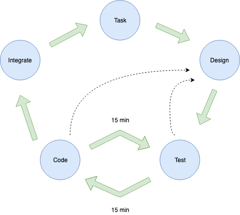

## Tasking Cycle

### Summary

#### Value short feedback loops. Feedback loops include:
- unit tests
- production feedback
- user feedback
- any data that provides data on the value/performace/inpact of the product

#### Use pair-programming in teams for all code to be merged to master.
Benefits:
- Removal of "Run over by buss" problem
- Disperse best practices in the team
- Share programming knowledge (make masters)
- Share knowledge about the system with new developers

Pair programming techniques:
 - Ping pong programming (one write the test, another make it pass)

Avoid pairing equally skilled people.
Master, Novice
Master, Journeyman
Journeyman, Novice

NOT -> Novice, Novice or Journeyman, Journeyman

### Code Quality

#### Functions/Methods
 - Dont change mutable parameters passed into a function/method
 - Return a copy back
 - Name a method after what it returns -> square.area()

### Refactoring

- Only refactor when all tests are green

#### When a new design emerges 
 1. change the design
 2. make the old tests pass
When this is completed you can create new features with the design.

Refactor usage of nil/None/null to usage of the [Null object pattern](https://en.wikipedia.org/wiki/Null_object_pattern)

### Skill Impact

Team skills go up during project

Speed goes up

Refactor, refactor, refactor

### Vocabulary

- Know your language
- Know your libraries
- Know your patterns
    - Design patterns
    - Analysis patterns
    - Coding patterns

NOTE: Use pair-programming to share this knowledge

### Code is done when
1. It works
2. Communicates
3. No duplicate code
4. Fewest classes and methods

Delete commented-out code

